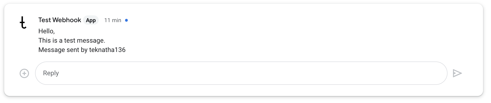

# Send Google Chat Text Message using space incoming Webhook

Note: This action is only for sending text messages, does not support Card messages.

TO make use of this action add the following steps to your GitHub Action workflow:

```yaml
      - uses: teknatha136/actions-google-chat-text-message@main
        with:
          google-chat-webhook: ${{ secrets.GOOGLE_CHAT_WEBHOOK }}
          text-message: The actual Message
```

In above action `google-chat-webhook` take the Google Chat Space's incoming webhook. Follow docs <https://developers.google.com/chat/how-tos/webhooks#create_a_webhook> to create a webhook.

`text-message` is the actual message you want to send.

Example usage

```yaml
name: Google Chat
on:
  push:
    branches: ["**"]    
jobs:
  send-message:
    runs-on: ubuntu-latest

    steps:
      - name: Checkout Code
        uses: actions/checkout@v3
      - uses: teknatha136/actions-google-chat-text-message@main
        with:
          google-chat-webhook: ${{ secrets.GOOGLE_CHAT_WEBHOOK }}
          text-message: Hello,\nThis is a test message.\nMessage sent by ${{ github.actor }}
```

This example delivers message as below.

  
